<p align="center">
  <a href="https://github.com/christianalcantara/ntk">
    
  </a>
</p>

<h2 align="center" style="color: white;" ali>Sistema de Gestão de Propostas de Empréstimo Pessoal</h3>

<ol>
<li>
  <a href="#sobre-o-projeto">Sobre o Projeto</a>
</li>
<li>
  <a href="#começando">Começando</a>
</li>
<li>
  <a href="#mãos-na-massa">Mãos na massa</a>
  <ul>
    <li><a href="#usuário">Usuário</a></li>
    <li><a href="#administrador">Administrador</a></li>
  </ul>
</li>
<li>
   <a href="#explore">Explore</a>
</li>
</ol>

<!-- SOBRE O PROJETO -->

## Sobre o Projeto

<details>

### Desafio

O objetivo deste desafio é criar um sistema onde os usuários possam cadastrar propostas de empréstimo pessoal e realizar
sua avaliação através de uma fila RabbitMQ utilizando o Django Celery.

### Estrutura da Proposta

O administrador do sistema poderá cadastrar os campos que devem constar na proposta através do django-admin. Por
exemplo, os seguintes campos podem ser cadastrados:

- Nome Completo
- CPF
- Endereço
- Valor do Empréstimo Pretendido

### Página de Preenchimento da Proposta

Deve ser criada uma página onde o possível cliente poderá preencher a proposta, utilizando os campos cadastrados
anteriormente. É importante ressaltar que o frontend não deve fazer comunicação direta com o Django, toda a comunicação
deve ser feita através do Django Rest Framework. O desenvolvedor pode utilizar um framework de sua preferência, como
React, Vue, Angular, ou mesmo HTML com JS.

</details>

<!-- COMEÇANDO -->

## Começando

Para executar o projeto é necessário ter o Docker + Docker Compose instalado.

https://docs.docker.com/compose/install/

#### Baixe o repositório do github

```bash
$ git clone https://github.com/christianalcantara/plp.git
```

#### Instalação

```bash
$ cd plp # Acessar o diretório do projeto
$ docker compose up
# ou
$ docker-compose up

# se necessário use o parâmetro --build no final dos comandos acima.
# Geralmente utilizado quando há modificações no código fonte.
$ docker-compose up --build
```

[](https://asciinema.org/a/lbaeiwVjwWKTuGMHRBXyR4ZnQ)

<!-- USABILIDADE -->

## Mãos na massa

### Usuário

Se tudo deu certo acesse a url: http://localhost:3000 para acessar o frontend e solicitar uma proposta.
Siga os passos na seguinte ordem:

<table>
<thead>
    <tr style="border: #e24545">
        <td class="tg-0pky" style="width: 33%; border: unset">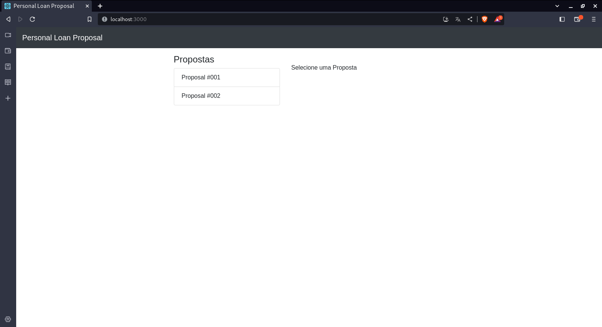</td>
        <td class="tg-0pky" style="width: 33%; border: unset">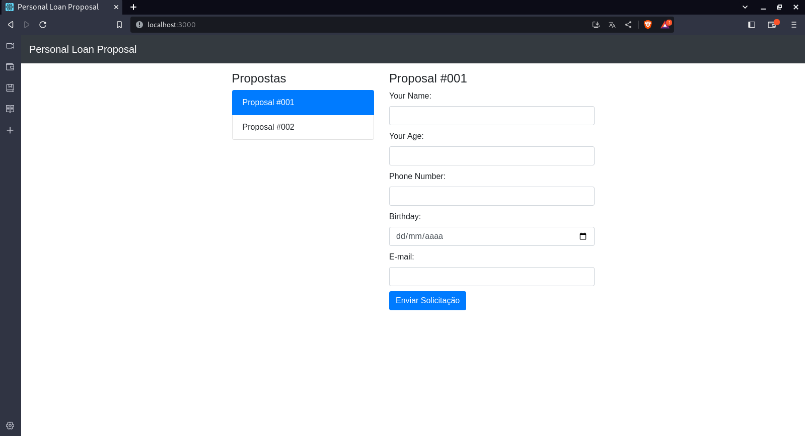</td>
        <td class="tg-0pky" style="width: 33%; border: unset">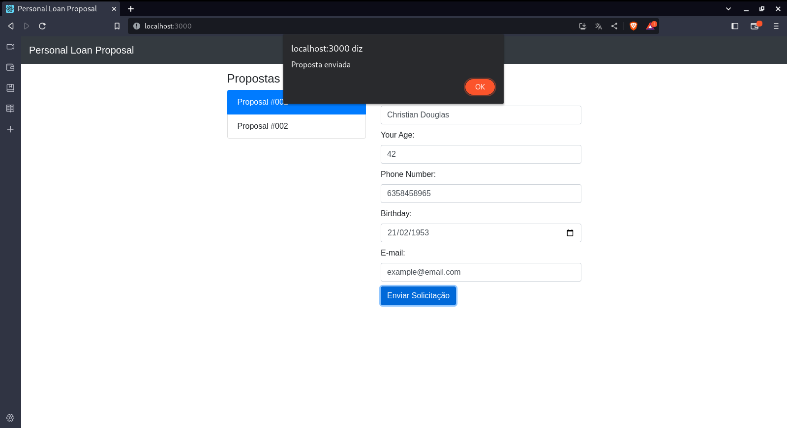</td>
    </tr>
    <tr style="border: #e24545">
        <td class="tg-0pky" style="width: 33%; border: unset">1. Selecione uma proposta</td>
        <td class="tg-0pky" style="width: 33%; border: unset">2. Preencha as informações</td>
        <td class="tg-0pky" style="width: 33%; border: unset">3. Clique em <b>Enviar Proposta</b></td>
    </tr>

</thead>
</table>

### Administrador

Se você é administrador do sistema acesse a url: http://localhost:8000/admin.

- Credenciais:

```
Usuário: admin
Senha  : admin
```

<table>
<thead>
    <tr style="border: unset">
        <td class="tg-0pky" style="text-align: center; width: 50%; border: unset">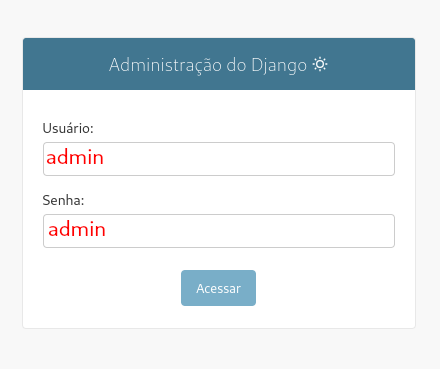</td>
        <td class="tg-0pky" style="text-align: center; width: 50%; border: unset">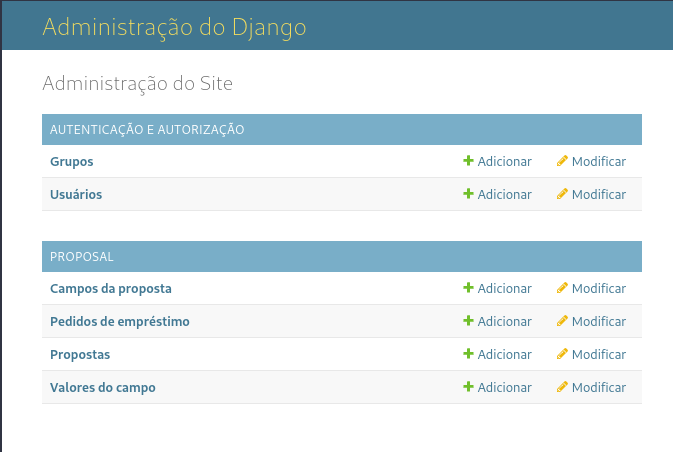</td>
    </tr>
    <tr style="border: #e24545">
        <td class="tg-0pky" style="border: unset">1. Tela de login</td>
        <td class="tg-0pky" style="border: unset">2. Menu administrativo</td>
    </tr>
</thead>
</table>

##### Para cadastrar uma proposta é muito simples, siga os passos a seguir:

<table>
<thead>
    <tr style="border: #e24545">
        <td class="tg-0pky" style="text-align: center; width: 33%; border: unset"></td>
        <td class="tg-0pky" style="text-align: center; width: 33%; border: unset">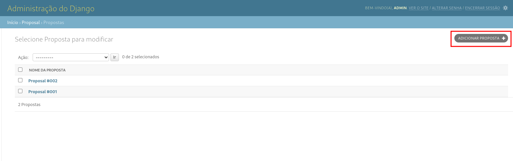</td>
        <td class="tg-0pky" style="text-align: center; width: 33%; border: unset">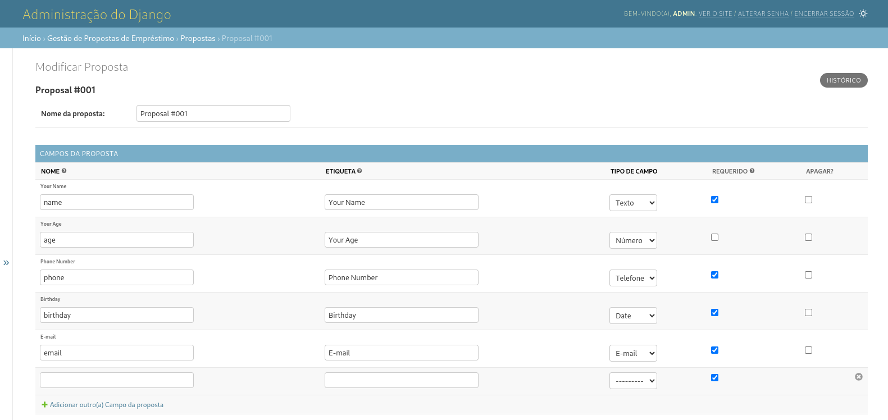</td>
    </tr>
    <tr style="border: #e24545">
        <td class="tg-0pky" style="border: unset">1. Acesse o menu <b>Proposta</b></td>
        <td class="tg-0pky" style="border: unset">2. Altere ou crie uma <b>Proposta</b></td>
        <td class="tg-0pky" style="border: unset">3. Defina um título e adicione os campos da <b>Proposta</b></td>
    </tr>
</thead>
</table>

##### Para visualizar uma pedido de empréstimo é mais simples ainda:

<table>
<thead>
    <tr style="border: #e24545">
        <td class="tg-0pky" style="text-align: center; width: 33%; border: unset">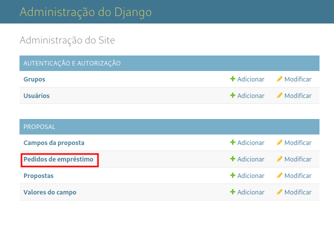</td>
        <td class="tg-0pky" style="text-align: center; width: 33%; border: unset">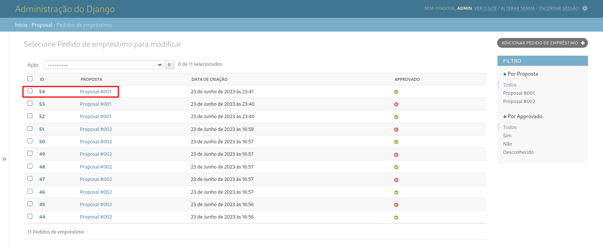</td>
        <td class="tg-0pky" style="text-align: center; width: 33%; border: unset">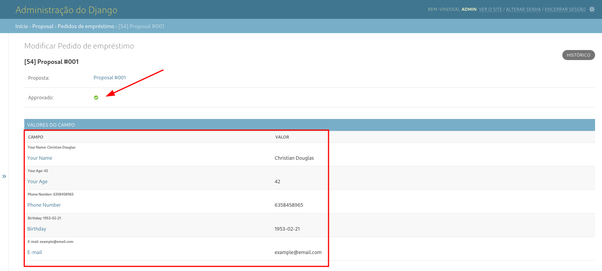</td>
    </tr>
    <tr style="border: #e24545">
        <td class="tg-0pky" style="border: unset">1. Acesse o menu <b>Pedidos de empréstimo</b></td>
        <td class="tg-0pky" style="border: unset">2. Selecione um pedido caso queira ver os campos preenchidos</td>
        <td class="tg-0pky" style="border: unset">3. <b>Voilà</b></td>
    </tr>
</thead>
</table>
<p style="color: red">Obs: Os pedidos enviados pelo frontend, são processados em um intevalo de 10 segundos no RabbitMQ/Celery.</p>

##### Para Aprovar/Negar um pedido de empréstimo:

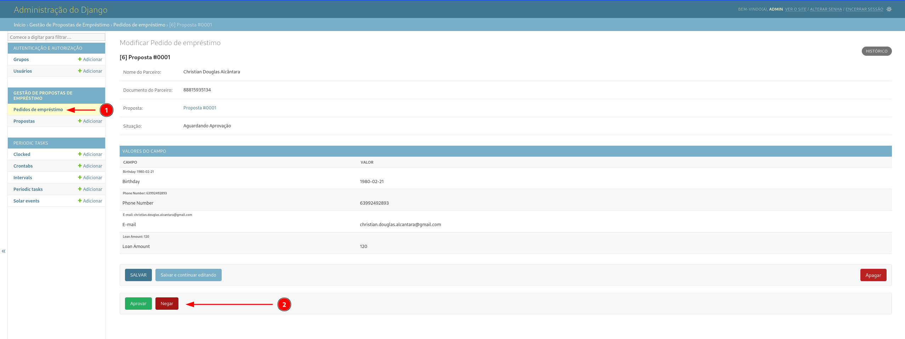

1. Selecione um pedido de empréstimo com o status `Aguardando Aprovação`.
2. Clique no botão `Aprovar` ou `Negar

## Explore

✨ 🍰 ✨

Caso, seja curioso acesse a url: http://localhost:8000 e veja alguns endpoints disponíveis.

<p align="center">
    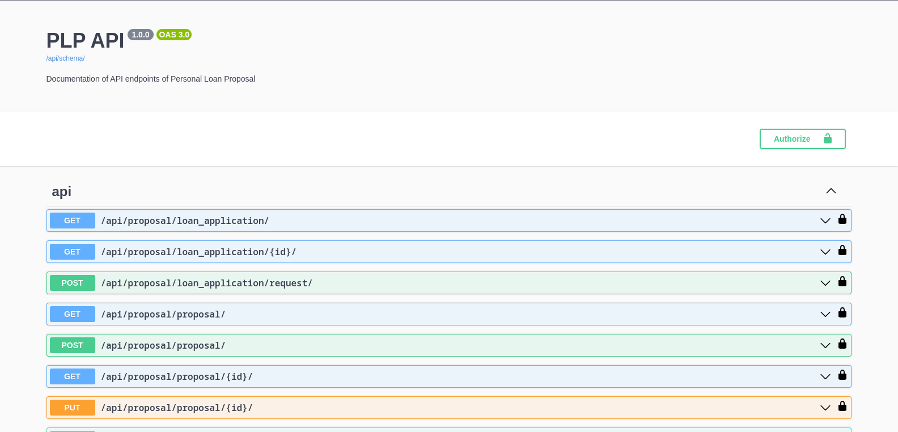
</p>
